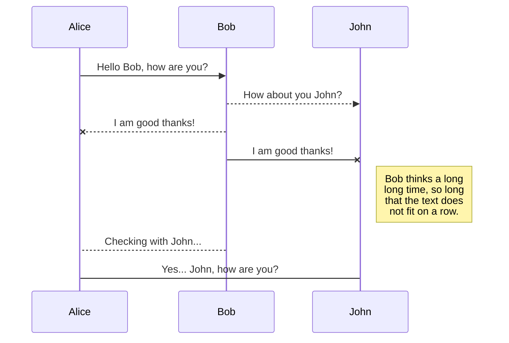
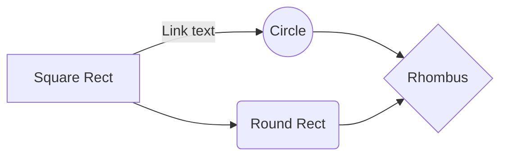

Documentation stored with source files shares the same permissions.
Documentation stored in a separate Git repository can use different
access controls. If Gerrit Code Review is being used, branch level
read permissions can be used to grant or restrict access to any
documentation branches.

## READMEs

Files named `README.md` are automatically displayed below the file's
directory listing. For the top level directory this mirrors the
standard [GitHub](https://github.com/) presentation.

\*\*\* promo
README.md files are meant to provide orientation for developers
browsing the repository, especially first-time users.

---

Test Image:


---

We recommend that Git repositories have an up-to-date top-level
`README.md` file.

## Markdown syntax

Gitiles supports the core Markdown syntax described in
[Markdown Basics]. Additional extensions are supported
to more closely match [GitHub Flavored Markdown] and
simplify documentation writing.

[markdown basics]: http://daringfireball.net/projects/markdown/basics
[github flavored markdown]: https://help.github.com/articles/github-flavored-markdown/

```js
import Typography from 'typography'

const typography = new Typography({
  baseFontSize: '18px',
  baseLineHeight: 1.666,
  headerFontFamily: ['Avenir Next', 'Helvetica Neue', 'Arial', 'sans-serif'],
  bodyFontFamily: ['Georgia', 'serif'],
  // See below for the full list of options.
})

// Output CSS as string.
typography.toString()

// Or insert styles directly into the <head> (works well for client-only
// JS web apps.
typography.injectStyles()
```

```html
<h1>Sample JavaScript</h1>
<div class="gatsby-highlight">
  <pre class="language-jsx">
    <code>
      <!-- Embedded content here ... -->
    </code>
  </pre>
</div>

<h1>Sample HTML</h1>
<div class="gatsby-highlight">
  <pre class="language-html">
    <code>
      <!-- Embedded content here ... -->
    </code>
  </pre>
</div>
```

```js
var rows = prompt('How many rows for your multiplication table?')
var cols = prompt('How many columns for your multiplication table?')
if (rows == '' || rows == null) rows = 10
if (cols == '' || cols == null) cols = 10
createTable(rows, cols)
function createTable(rows, cols) {
  var j = 1
  var output = "<table border='1' width='500' cellspacing='0'cellpadding='5'>"
  for (i = 1; i <= rows; i++) {
    output = output + '<tr>'
    while (j <= cols) {
      output = output + '<td>' + i * j + '</td>'
      j = j + 1
    }
    output = output + '</tr>'
    j = 1
  }
  output = output + '</table>'
  document.write(output)
}
```

### Table

| Option | Description                                                               |
| ------ | ------------------------------------------------------------------------- |
| data   | path to data files to supply the data that will be passed into templates. |
| engine | engine to be used for processing templates. Handlebars is the default.    |
| ext    | extension to be used for dest files.                                      |

Right aligned columns

| Option |                                                               Description |
| -----: | ------------------------------------------------------------------------: |
|   data | path to data files to supply the data that will be passed into templates. |
| engine |    engine to be used for processing templates. Handlebars is the default. |
|    ext |                                      extension to be used for dest files. |

### Lists

A bullet list:

```
* Fruit
    * Orange
    * Pear
* Cake
```

will render into HTML as:

- Fruit
  - Orange
  - Pear
- Cake

The second level items (above Orange, Pear) must be indented with more
spaces than the item they are nested under. Above 2 spaces were used.
Additionally, the entire list must be preceded and followed by a blank
line.

A numbered list:

```
1. Fruit
     1. Orange
     2. Pear
2. Cake
```

will render into HTML as:

1. Fruit
   1. Orange
   2. Pear
2. Cake

### Blockquotes

Sir Winston Churchill once said:

> A lie gets halfway around the world before the truth has a
> chance to get its pants on.

### Mathematical expressions

You can render LaTeX mathematical expressions.

The _Gamma function_ satisfying $\Gamma(n) = (n-1)!\quad\forall n\in\mathbb N$ is via the Euler integral

$$
\Gamma(z) = \int_0^\infty t^{z-1}e^{-t}dt\,.
$$

### UML diagrams

You can render UML diagrams, this will produce a sequence diagram:



And this will produce a flow chart:



Libraries often attempt to remain neutral in the resulting debates, but that neutrality is predicated on the idea that the debates are taking place on a post-enlightenment playing field and that, eventually, the best ideas will succeed. Or at least that, over time, reasonable people will develop a shared set of facts and tools for assessing and discussing that reality. This allows the library to accomplish good for its users by providing access
